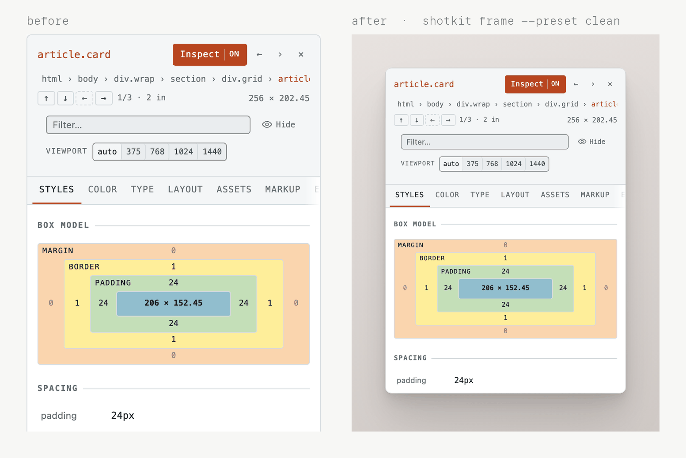
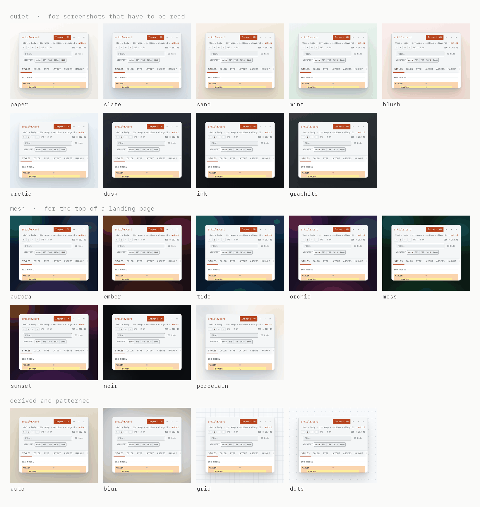
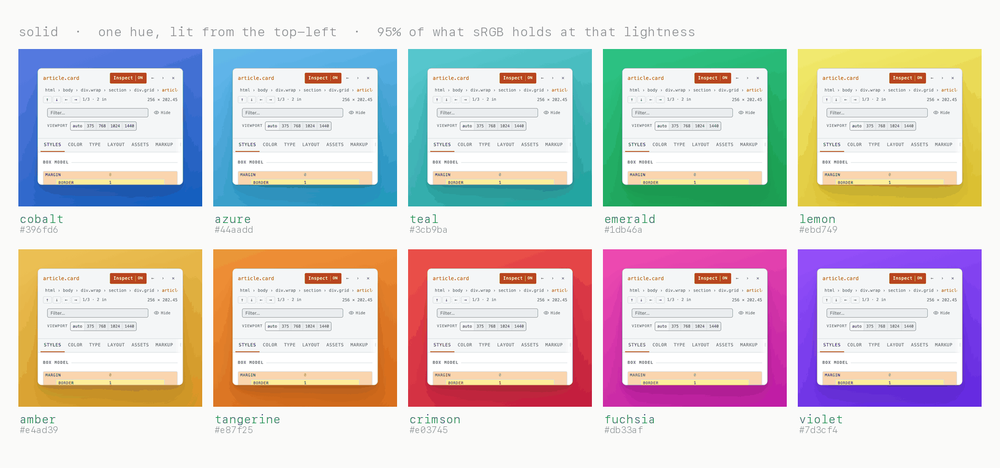
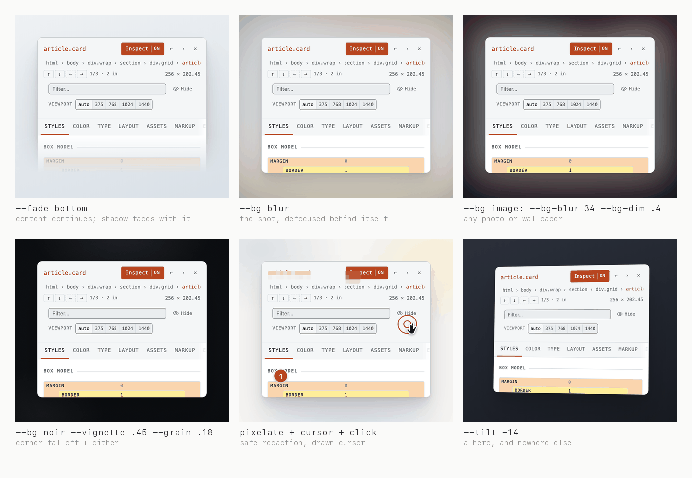

# shotkit

Screenshots that look like a product shipped them, not like a bug report.

A capture-and-frame tool in the spirit of [Shottr](https://shottr.cc), [CleanShot X](https://cleanshot.com)
and [Screely](https://screely.com) — but driven from a command line, so it belongs in a build
script and in an agent's hands rather than in a menu bar. It ships as both a **CLI** and an
**agent skill**: the skill file carries the judgement about *when* to reach for which part, which
is most of what separates a good screenshot from a decorated one.



No dependencies. It renders the frame as HTML and screenshots it, using Playwright if the project
has it and a local Chrome/Chromium otherwise.

## The one rule

**A frame cannot rescue a bad capture.** Padding, shadow and a mac window around a shot whose text
is cut mid-glyph makes the defect *more* obvious — you have drawn a nice border around the mistake
and lit it. The effort goes in this order:

1. **Capture** clean and deterministic
2. **Crop** at a boundary the UI actually has
3. **Frame** it
4. **Check** it

Most bad screenshots are lost at step 1 or 2, and no amount of step 3 gets them back.

## Install

**As a CLI:**

```bash
npm i -D github:patlf/shotkit
npx shotkit
```

**As an agent skill** — clone it where your agent looks for skills. `SKILL.md` is at the root, so
the directory works as-is:

```bash
git clone https://github.com/patlf/shotkit ~/.claude/skills/shotkit
```

For a project-local skill, clone into `.claude/skills/` instead. Other agents can be pointed at
`SKILL.md` directly, or you can paste its Quick start into an `AGENTS.md`.

`frame` and `check` need only Node 20+ and a Chrome/Chromium somewhere on the machine. `capture`
drives a real browser, so it needs Playwright:

```bash
npm i -D playwright && npx playwright install chromium
```

## Three commands

```bash
# Capture a live page and frame it in one pass
shotkit capture http://localhost:3000 --out hero.png \
    --selector ".app-shell" --viewport 1440x900 --preset mac --title "Acme"

# Frame a screenshot you already have — ⌘⇧4, Shottr, CleanShot, a Figma export
shotkit frame raw.png --out hero.png --preset clean

# Frame a whole set consistently
shotkit frame raw/*.png --out shots/ --preset clean --scale 2

# Audit what you have, and shrink it
shotkit check shots/
shotkit optimize shots/ --max-kb 400
```

## Backdrops

`--bg` is the single biggest lever on how a screenshot reads. Three families, plus two derived
from the image itself.



| | |
| --- | --- |
| **`auto`** *(default)* | Samples the shot's own edge pixels and derives a backdrop in OKLCH with chroma capped hard. Cannot clash: every colour in it came from the shot. |
| **`blur`** | The screenshot painted again behind itself, scaled up and defocused. Same guarantee, more depth. |
| **quiet** | `paper` `slate` `sand` `mint` `blush` `arctic` `dusk` `ink` `graphite` — low-chroma, for screenshots that have to be *read*. |
| **solid** | `cobalt` `azure` `teal` `emerald` `lemon` `amber` `tangerine` `crimson` `fuchsia` `violet` — one saturated hue, lit from the top-left. |
| **mesh** | `aurora` `ember` `tide` `orchid` `moss` `sunset` `noir` `porcelain` — a base with offset radial bleeds, for a landing-page hero. |
| **`image:<path>`** | A photo or wallpaper. Pair with `--bg-blur` and `--bg-dim`, or the UI on top stops being readable. |
| **`grid:` / `dots:`** | Technical rather than promotional. Good for developer tools. |
| **`transparent`** | Real alpha, including through the shadow. |



The solid family is generated from one OKLCH triple per hue, not written as CSS. A gradient
between two saturated sRGB colours dips in chroma through the middle and goes muddy; in OKLCH the
hue and saturation hold along the ramp, so it reads as one colour lit unevenly rather than as a
gradient between two. Each chroma is 95% of the most sRGB can hold at that lightness and hue,
solved rather than eyeballed — ask for more and the browser gamut-maps the two stops by different
amounts, which bends the ramp. Adding a hue is one line.

## Everything else



- **`--fade bottom`** dissolves an edge into the backdrop instead of slicing it, and the mask
  covers the shadow too — a shot that dissolves while still casting a hard shadow underneath looks
  broken. The honest fix when a panel is genuinely taller than its space.
- **`--pad "30 30 0"`** takes one to four values in CSS order, and a zero edge bleeds the shot off
  that side, squaring off its corners there. Containing a very tall shot instead means shrinking
  its type past reading.
- **Annotations** — arrows, numbered badges, highlight boxes, spotlight dimming, blur, pixelation,
  solid redaction, a drawn macOS cursor and a click indicator. Coordinates are in source-image CSS
  pixels, so nothing moves when you change the padding.
- **`--tilt`**, **`--vignette`**, **`--grain`**, **`--ratio 16:9`** for store and social sizes.

**Prefer `pixelate` over `blur` for anything that must not be recoverable.** A Gaussian blur is a
convolution, and with the font and layout known a short string like a six-digit code can be
brute-forced back out of it. Quantising to blocks throws the information away instead.

## check

```bash
shotkit check shots/
```

Reports, and exits non-zero on: an edge that cuts through content, images over the file-size
budget, images too small for where they will be displayed, and a set whose members are different
sizes. It reads the pixels, so it catches what review misses — whoever chose the crop was looking
at the content, not at the boundary.

Drop it in a verify script and a bad crop fails the build.

## Three things it does that usually get done wrong by hand

- **The shadow is stacked, not single.** Six layers from a tight contact shadow out to a wide
  ambient one. A single `0 20px 60px rgba(0,0,0,.3)` gives a uniform grey halo with no contact,
  which is the clearest tell of a screenshot that was decorated rather than lit.
- **The source is never resampled.** It is placed at exactly `naturalWidth / --scale` CSS px on a
  whole device pixel. `--scale` says what DPR the source was captured at; it does not resize
  anything. Get it wrong and you lose the sharpness you captured at 2× for.
- **The hairline follows the shot, not the backdrop.** The rim sits 1px inside the shot's own
  edge, so what it must stand out against is the shot: a light UI takes a dark rim and a dark UI
  takes a light one, whatever is behind them. Measured from the pixels at render time.

## Full reference

`shotkit` with no arguments prints every flag. [`SKILL.md`](SKILL.md) is the workflow and the
judgement; [`references/recipes.md`](references/recipes.md) has the annotation spec, batching,
store sizes, CI and the full flag tables.

## License

MIT
